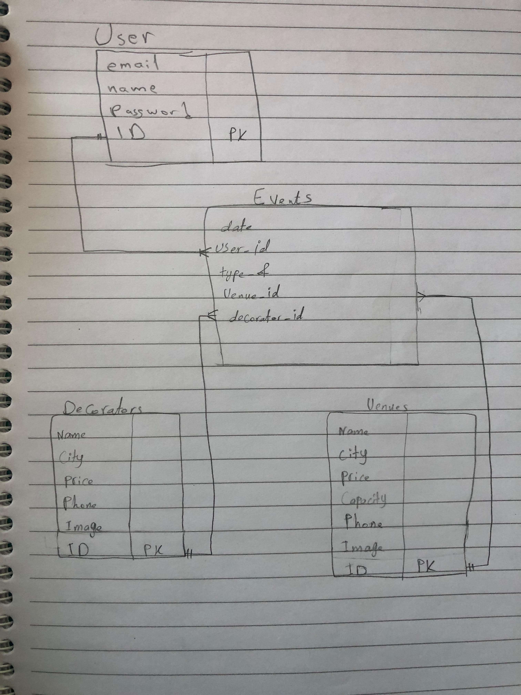

<!-- # README

This README would normally document whatever steps are necessary to get the
application up and running.

Things you may want to cover:

* Ruby version

* System dependencies

* Configuration

* Database creation

* Database initialization

* How to run the test suite

* Services (job queues, cache servers, search engines, etc.)

* Deployment instructions

* ...

-------------- -->

 # Project Name
    Occassion Planner

<!-- project deployment -->

# Technologies Used
 * Front End:
     * HTML
     * CSS
     * Bootstrap
 * Back-End:
     * Rails
     * Postgres

<!-- Links -->
<!-- [Google](http://google.com) -->
<!-- images -->
<!--  -->

<!-- hr  --- -->
# User Stories
A website that can be used by anyone in Saudi Arabia to plan and reserve for their events. The website should have the services that serves the client's needs for her/his occassion such as the venue and decorator. The client can view the decorators and venues list and then jump to the event's schedule to reserve through it and view her/his schedule of the reserved events. In the schedule client can create an event, edit it and finaly destroy it. 

# Planning and Development Process
The plan is to have three tables, the first one is for the venues the second table for decorators and the third one for the events.
The devise authentication has been used, so a user table has been made.
After the user signed up, the home page appeared. It consists of the venue option the the decorators option and finally the events' schedule.
The venues option showed up the venues table. It has five attributes, the name, city, price, capacity, phone and images. The schedule display some features, clicking in 'More info' will show up all the attributes with their values. The back button will take you back to the venues table and agian the other back button will get you back to the home page.
The decotators option show up the decorators table as well. The features are the decorator's name, city, price, phone number and the images of the decorator's work, if exists. clicking in the 'More info' show up all the attributes, Back button to the decorator's page, then Back button to the home page.
The event option where your reservations take place. Clicking on the 'New Event' button take you to the creation page. There you can pick the suitable date, venue, decorator, and the type of the event. Clicking on 'Create Event' will take you to the created event, and 'Your Events' will take you back to the events schedule page. After clicking on the 'Create Event' button, the event created will show up with all choosen values. 'Edit' button allow you to edit the created event, and 'Back' button will take you to the events schedule with the created event. 

# ERD

<!-- # Describe any lines or function in the code -->

<!-- ## Challenges -->

<!-- # Unsolved problems which would be fixed in future iterations. -->

